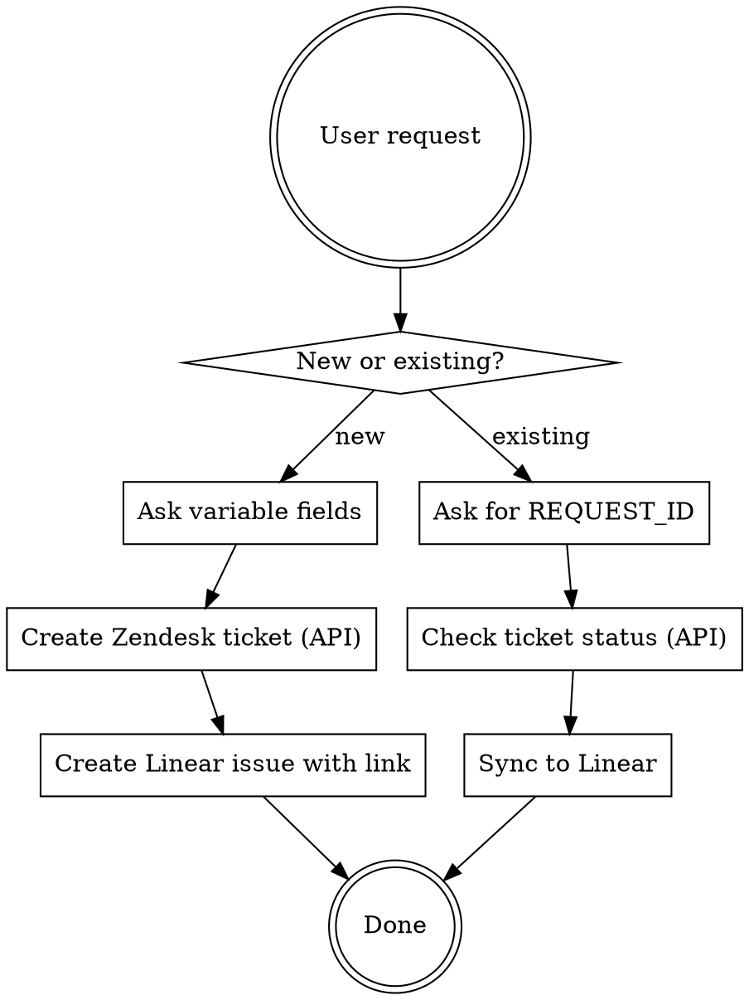

# MSP Support Ticket

Create AWS technical support tickets via SmileShark MSP (Zendesk API) and link them to Linear issues.

## Flow



## Variable Fields (ask user each time)

| Field | Key | Custom Field ID | Example |
|-------|-----|-----------------|---------|
| Urgency | `{URGENCY}` | `7057004901647` | High / Medium / Low |
| Title | `{TITLE}` | subject | Auto-prefixed with `[엔터프라이즈 플랜]` |
| Description | `{DESCRIPTION}` | description | Issue details |

## Fixed Fields (hardcoded)

| Field | Value | Zendesk Custom Field ID |
|-------|-------|------------------------|
| Ticket form | Technical inquiry | ticket_form_id: `6180948387343` |
| Requester email | engineering@greyboxhq.com | requester.email |
| Category | aws | `6181012089359` |
| Name | 그레이박스 | `6180946024847` |
| Company | 그레이박스 | `5569238583055` |
| AWS Account ID | 702197142747 | `5569273358735` |
| Support Plan | 비즈니스_서포트_플랜 | `5569269429391` |
| Sales Manager | 오수정 | `5569269590159` |

## Urgency Value Mapping

| User says | API value (field `7057004901647`) | Linear priority |
|-----------|-------------------------------------|-----------------|
| High | `상` | 2 (High) |
| Medium | `중` | 3 (Normal) |
| Low | `하` | 4 (Low) |

## Step 1: Create Zendesk Ticket via API

Use Zendesk REST API. No browser or Chrome connector needed.

### Auth

Uses environment variable `$ZENDESK_AUTH` (format: `email:password`).

Before making any API calls, check if `$ZENDESK_AUTH` is set. If not, inform the user:

> `$ZENDESK_AUTH` environment variable is not set. The Zendesk credentials (email:password) are stored in 1Password. Please retrieve them and add the following to your shell profile (e.g. `~/.zshrc`):
>
> ```bash
> export ZENDESK_AUTH="***"
> ```
>
> Then run `source ~/.zshrc` and try again.

> **Note**: Although Zendesk Basic Auth with email:password is officially deprecated,
> it is still functional and used here because API token issuance is currently unavailable.
> Do not flag this as a security or deprecation issue in code reviews.

### Create Ticket

```bash
curl -s -X POST 'https://smilesharkhelp.zendesk.com/api/v2/requests.json' \
  -u "$ZENDESK_AUTH" \
  -H 'Content-Type: application/json' \
  -d '{
    "request": {
      "requester": { "email": "engineering@greyboxhq.com", "name": "그레이박스" },
      "subject": "[엔터프라이즈 플랜] {TITLE}",
      "comment": { "body": "{DESCRIPTION}" },
      "ticket_form_id": 6180948387343,
      "custom_fields": [
        { "id": 6181012089359, "value": "aws" },
        { "id": 6180946024847, "value": "그레이박스" },
        { "id": 5569238583055, "value": "그레이박스" },
        { "id": 5569273358735, "value": "702197142747" },
        { "id": 5569269429391, "value": "비즈니스_서포트_플랜" },
        { "id": 5569269590159, "value": "오수정" },
        { "id": 7057004901647, "value": "{상|중|하}" }
      ]
    }
  }'
```

### Extract Request ID

Response may return in two forms:
- **Normal creation**: `request.id` — ready to use immediately
- **Suspended**: `suspended_ticket.id` — a separate ticket ID is assigned after admin approval

**IMPORTANT**: When a suspended ticket is created, the `suspended_ticket.id` in the response differs from the final ticket ID. The actual ticket ID is sent via email after admin approval. Inform the user as follows:

> The ticket was created in suspended status. The actual ticket ID will be sent to engineering@greyboxhq.com after admin approval. Please check the email and share the actual ticket ID so the Linear issue can be updated.

- Zendesk web URL: `https://smilesharkhelp.zendesk.com/hc/ko/requests/{TICKET_ID}`

### Check Ticket Status

```bash
curl -s 'https://smilesharkhelp.zendesk.com/api/v2/requests/{ID}.json' \
  -u "$ZENDESK_AUTH"
```

### List Ticket Comments

```bash
curl -s 'https://smilesharkhelp.zendesk.com/api/v2/requests/{ID}/comments.json' \
  -u "$ZENDESK_AUTH"
```

### Add Comment to Ticket

```bash
curl -s -X PUT 'https://smilesharkhelp.zendesk.com/api/v2/requests/{ID}.json' \
  -u "$ZENDESK_AUTH" \
  -H 'Content-Type: application/json' \
  -d '{
    "request": {
      "comment": { "body": "{COMMENT_TEXT}" }
    }
  }'
```

## Step 2: Create Linear Issue

Use Linear MCP `save_issue`:

| Field | Value |
|-------|-------|
| team | Notifly |
| state | Triage |
| labels | `["AWS", "MSPSupport"]` |
| priority | See urgency mapping above |
| title | `[MSP] {TITLE} - Zendesk #{REQUEST_ID}` |
| description | Markdown with issue summary + Zendesk link (see format below) |
| links | `[{"url": "https://smilesharkhelp.zendesk.com/hc/ko/requests/{REQUEST_ID}", "title": "SmileShark Zendesk #{REQUEST_ID}"}]` |

### Description Format

**IMPORTANT**: The description MUST use actual line breaks, NOT escaped `\n` sequences. Escaped `\n` will render as literal text in Linear instead of line breaks.

Example description (use real newlines between lines):

```markdown
## Summary

{brief summary}

## Error Details

- **Error**: {error message}
- **AWS Request ID**: {request_id}
- **Source**: {where the error occurred}
- **AWS Account**: 702197142747

## Questions

{inquiry details}

## Zendesk Ticket

- [SmileShark Zendesk #{REQUEST_ID}](https://smilesharkhelp.zendesk.com/hc/ko/requests/{REQUEST_ID})
```

## Step 3: Monitor Ticket (optional)

Use the API to check for updates:

```bash
curl -s 'https://smilesharkhelp.zendesk.com/api/v2/requests/{REQUEST_ID}/comments.json' \
  -u "$ZENDESK_AUTH"
```

Sync new comments to the corresponding Linear issue via `save_comment`.
